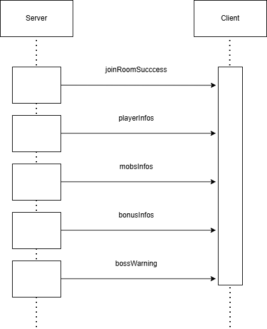

# 🏹 Archoot (Equipe 5 - Groupe I)

**Equipe :**
* Lecnik Liam : [liam.lecnik.etu@univ-lille.fr](mailto:liam.lecnik.etu@univ-lille.fr)
* Mangin Maxence : [maxence.mangin.etu@univ-lille.fr](mailto:maxence.mangin.etu@univ-lille.fr)
* Martin Rémy : [remy.martin.etu@univ-lille.fr](mailto:remy.martin.etu@univ-lille.fr)
* Vigneron Loïse : [loise.vigneron.etu@univ-lille.fr](mailto:loise.vigneron.etu@univ-lille.fr)

## 📜 Présentation du projet 

Archoot est un jeu de tir en 2D développé en **TypeScript**. L'objectif est d'incarner John Archoot et de survivre le plus longtemps possible face à des vagues d'ennemis en tout genre (araignées, oiseaux, ...) et les éliminer pour collecter des points et des bonus. 

## Echange Client-Serveur (Diagramme de séquence)

* _joinRoomSuccess_ : validation de l'entrée du joueur dans le salon de jeu.
* _playerInfos_ : Transmissions des données actualisées des joueurs.
* _mobsInfos_ : Transmission de la position et de l'état des monstres.
* _bonusInfos_ : Transmissions des infos des bonus générés sur la carte.
* _bossWarning_ : Événement pour alerter le joueur de l'arrivée imminente d'un boss. 

## 🕷️ Difficultés techniques

* **Synchronisation** : Gérer un affichage fluide des fléches (en particulier) et des monstres pour tous les joueurs, à 60FPS (sans saturation de la bande passante).  
* **Dette technique et refactoring** : Encore actuellement, certaines parties du code (boucle principale/gestion des états) ne sont pas "propres".  
* **L'implémentation des patterns de Boss** : L'ajout de "pattern" au Boss (notamment Le Tyrus) a été un défi. 

## 🎯 Points d'améliorations

* **Communication de l'équipe** : Bien que des créneaux d'autonomie dédiés aient été prévus dans notre emploi du temps pour avancer sur la SAE, la charge de travail globale de ce semestre a rendu la communication complexe. 
Néanmoins, l'équipe a su se mobiliser efficacement pour faire avancer le projet et rendre un jeu fonctionnel. 
* **Refactoring** : Terminer le refacto du code serait un gros point d'amélioration, afin de rendre notre code plus lisible et SOLID, ce qui pourrait donc améliorer sa maintenance et son évolution.  
* **Gameplay** : Pour rendre notre jeu plus attirants, nous pourrions ajouter des sons (lors de la mort d'un ennemi, pax exemple), une musique de jeu, des background qui changent selon le niveau dans lequel on est.  

## 💪 Fierté de l'équipe 

* Aspect visuel de notre jeu (UI, DA, etc.)  
* Bonne ambiance de travail
* La créativité du groupe = tout est fait main ! 

## 💭 Organisaton de l'équipe

* Issues Board de _GitLab_
* https://docs.google.com/spreadsheets/d/167llkRf2gxNPeo8jfRlDnexuLY13bvpllJN2hl2ihes/edit?usp=sharing